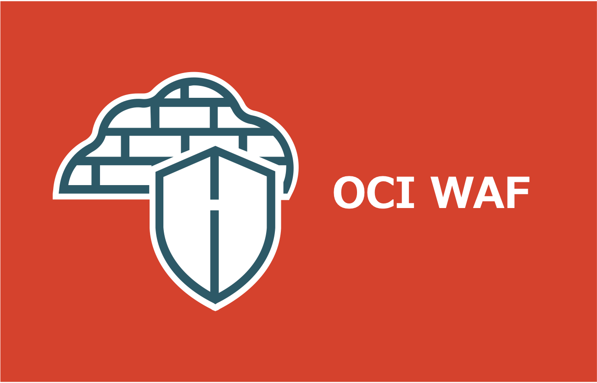
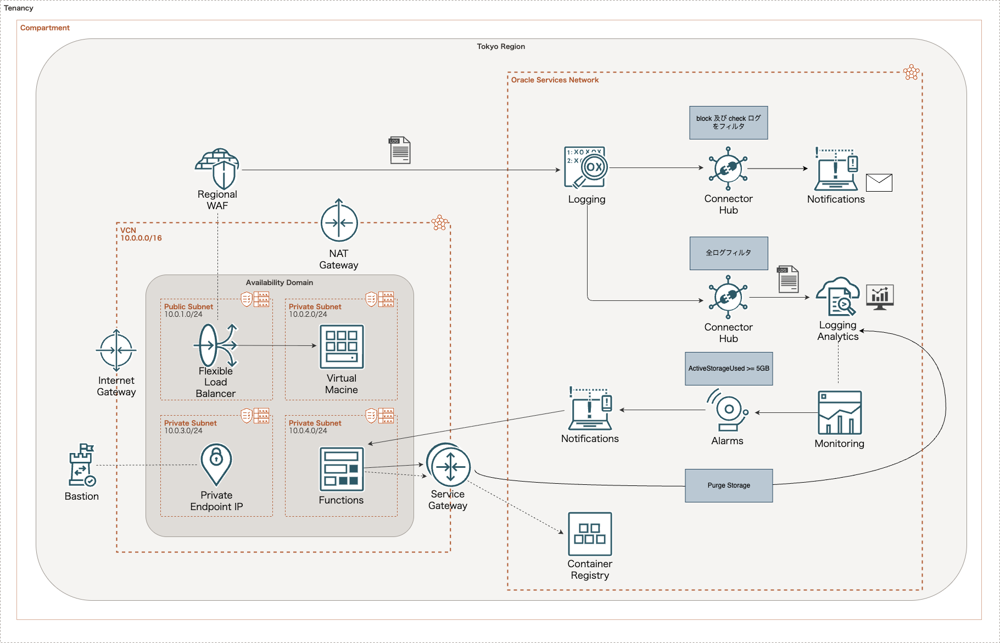

=====================================================================
OCI WAF ポリシーの運用管理環境を整備してみた
=====================================================================
* `詳細 <>`_

=====================================================================
構成図
=====================================================================

=====================================================================
デプロイ - Terraform -
=====================================================================

作業環境 - ローカル -
=====================================================================
* macOS Tahoe ( v26.3.1(a) )
* Visual Studio Code 1.115.0
* Terraform v1.14.5
* oci cli 3.71.0
* Python 3.14.2

フォルダ構成
=====================================================================
* `こちら <./folder.md>`_ を参照

前提条件
=====================================================================
* ``manage all-resources IN TENANCY`` を付与した IAM グループに所属する IAM ユーザーが作成されていること
* 実作業は *envs* フォルダ配下で実施すること
* 以下コマンドを実行し、*ADMIN* プロファイルを作成していること (デフォルトリージョンは *ap-tokyo-1* )

.. code-block:: bash

  oci session authenticate

事前作業(1)
=====================================================================
1. 各種モジュールインストール
---------------------------------------------------------------------
* `GitHub <https://github.com/tyskJ/common-environment-setup>`_ を参照

事前作業(2)
=====================================================================
1. *tfstate* 用バケット作成
---------------------------------------------------------------------
.. code-block:: bash

  TENANCY_ID=$(oci iam compartment list \
    --lifecycle-state ACTIVE \
    --include-root \
    --profile ADMIN \
    --auth security_token \
    --query "data[?\"compartment-id\"==null].id | [0]" \
    --raw-output)

.. code-block:: bash

  oci os bucket create \
  --compartment-id "${TENANCY_ID}" \
  --name terraform-working \
  --profile ADMIN --auth security_token

.. note::

  * バケット名は、テナンシかつリージョン内で一意であれば作成できます

実作業 - ローカル -
=====================================================================
1. *backend* 用設定ファイル作成
---------------------------------------------------------------------

.. note::

  * *envs* フォルダ配下に作成すること

.. code-block:: bash

  TENANCY_ID=$(oci iam compartment list \
    --lifecycle-state ACTIVE \
    --include-root \
    --profile ADMIN \
    --auth security_token \
    --query "data[?\"compartment-id\"==null].id | [0]" \
    --raw-output)

.. code-block:: bash

  NAMESPACE=$(oci os ns get \
    --compartment-id "${TENANCY_ID}" \
    --profile ADMIN \
    --auth security_token \
    --query "data" \
    --raw-output)

.. code-block:: bash

  cat <<EOF > config.oci.tfbackend
  bucket = "terraform-working"
  namespace = "${NAMESPACE}"
  key = "oci-waf-policy-operations-management-environment/terraform.tfstate"
  auth = "SecurityToken"
  config_file_profile = "ADMIN"
  region = "ap-tokyo-1"
  EOF

2. 変数ファイル作成
---------------------------------------------------------------------

.. note::

  * *envs* フォルダ配下に作成すること

.. code-block:: bash

  TENANCY_ID=$(oci iam compartment list \
    --lifecycle-state ACTIVE \
    --include-root \
    --profile ADMIN \
    --auth security_token \
    --query "data[?\"compartment-id\"==null].id | [0]" \
    --raw-output)

.. code-block:: bash

  NAMESPACE=$(oci os ns get \
    --compartment-id "${TENANCY_ID}" \
    --profile ADMIN \
    --auth security_token \
    --query "data" \
    --raw-output)

.. code-block:: bash

  cat <<EOF > oci.auto.tfvars
  tenancy_ocid = "${TENANCY_ID}"
  namespace = "${NAMESPACE}"
  loganalytics_onboard = true
  source_ip = "接続元IPアドレス(CIDR形式)"
  subscription_email = "Notifications用メールアドレス"
  EOF

3. *Terraform* 初期化
---------------------------------------------------------------------
.. code-block:: bash

  terraform init -backend-config="./config.oci.tfbackend"

4. 事前確認
---------------------------------------------------------------------
.. code-block:: bash

  terraform plan

5. デプロイ
---------------------------------------------------------------------
.. code-block:: bash

  terraform apply --auto-approve

後片付け - ローカル -
=====================================================================
1. 環境削除
---------------------------------------------------------------------
.. code-block:: bash

  terraform destroy --auto-approve

2. *tfstate* 用S3バケット削除
---------------------------------------------------------------------
.. code-block:: bash

  oci os bucket delete \
  --bucket-name terraform-working \
  --force --empty \
  --profile ADMIN --auth security_token

番外編
=====================================================================
コンパートメント削除失敗
---------------------------------------------------------------------
* コンパートメント削除に失敗する場合、対象コンパートメントに属するリソースが存在することが原因です
* その場合、以下コマンドを実行し存在するリソース一覧を確認し削除してください

.. code-block:: bash
  
  COMPARTMENT_NAME="oci-waf-policy-operations-management-environment"
  COMPARTMENT_ID=$(oci iam compartment list \
    --lifecycle-state ACTIVE \
    --profile ADMIN \
    --auth security_token \
    --query "data[?name=='${COMPARTMENT_NAME}'].id | [0]" \
    --raw-output)

.. code-block:: bash

  oci search resource structured-search \
  --query-text "query all resources where compartmentId = '${COMPARTMENT_ID}'" \
  --profile ADMIN \
  --auth security_token \
  --query "data.items[].{identifier:identifier, resource_type:\"resource-type\"}"

参考資料
=====================================================================
リファレンス
---------------------------------------------------------------------
* `terraform_data resource reference <https://developer.hashicorp.com/terraform/language/resources/terraform-data>`_
* `Backend block configuration overview <https://developer.hashicorp.com/terraform/language/backend#partial-configuration>`_
* `All Image Families - Oracle Cloud Infrastructure Documentation/Images <https://docs.oracle.com/en-us/iaas/images/>`_
* `タグおよびタグ・ネームスペースの概念 - Oracle Cloud Infrastructureドキュメント <https://docs.oracle.com/ja-jp/iaas/Content/Tagging/Tasks/managingtagsandtagnamespaces.htm#Who>`_
* `About the DNS Domains and Hostnames - Oracle Cloud Infrastructure Documentation <https://docs.oracle.com/en-us/iaas/Content/Network/Concepts/dns.htm#About>`_

ブログ
---------------------------------------------------------------------
* `Terraformでmoduleを使わずに複数環境を構築する - Zenn <https://zenn.dev/smartround_dev/articles/5e20fa7223f0fd>`_
* `Terraformでmoduleを使わずに複数環境を構築して感じた利点 - SpeakerDeck <https://speakerdeck.com/shonansurvivors/building-multiple-environments-without-using-modules-in-terraform>`_
* `個人的備忘録：Terraformディレクトリ整理の個人メモ（ファイル分割編） - Qiita <https://qiita.com/free-honda/items/5484328d5b52326ed87e>`_
* `Terraformの auto.tfvars を使うと、環境管理がずっと楽になる話 - note <https://note.com/minato_kame/n/neb271c81e0e2>`_
* `Terraform v1.9 では null_resource を安全に terraform_data に置き換えることができる -Zenn <https://zenn.dev/terraform_jp/articles/tf-null-resource-to-terraform-data>`_
* `Terraform cloudinit Provider を使って MIME multi-part 形式の cloud-init 設定を管理する - HatenaBlog <https://chaya2z.hatenablog.jp/entry/2025/10/15/040000>`_
* `TerraformのDynamic Blocksを使ってみた - DevelopersIO <https://dev.classmethod.jp/articles/terraform-dynamic-blocks/>`_