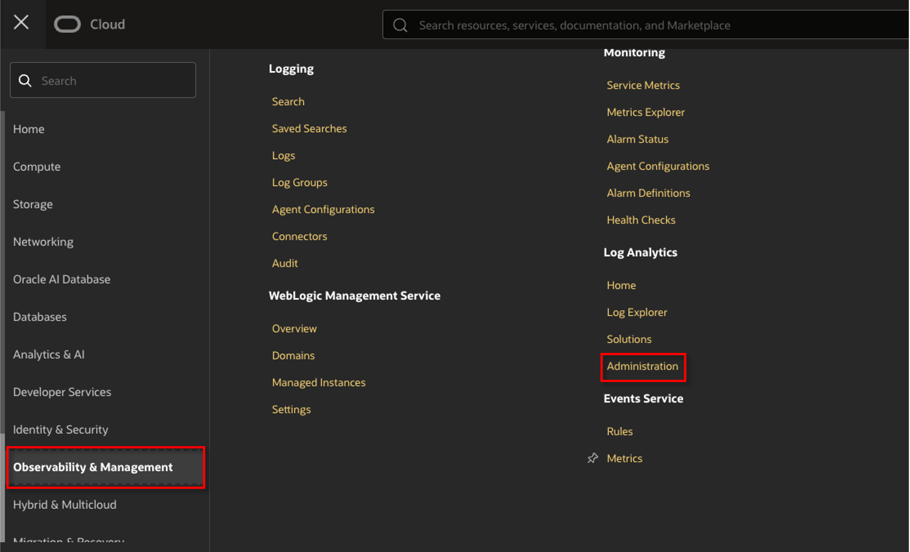
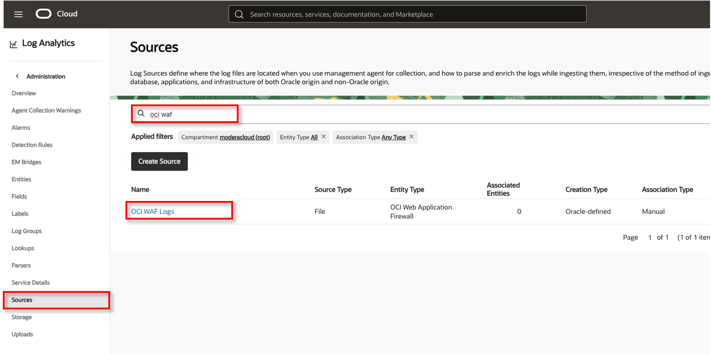
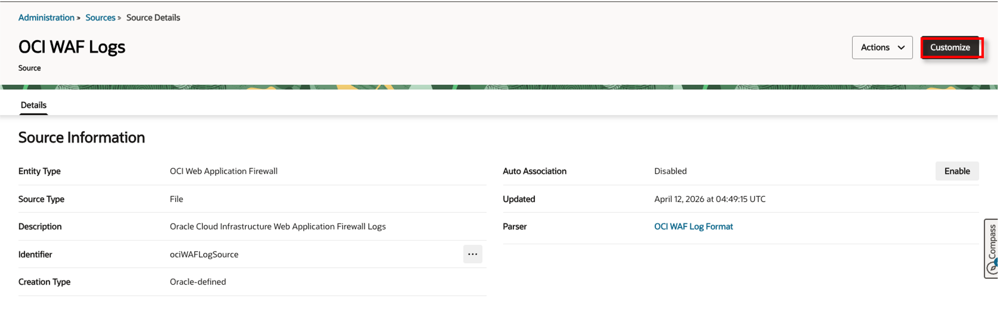
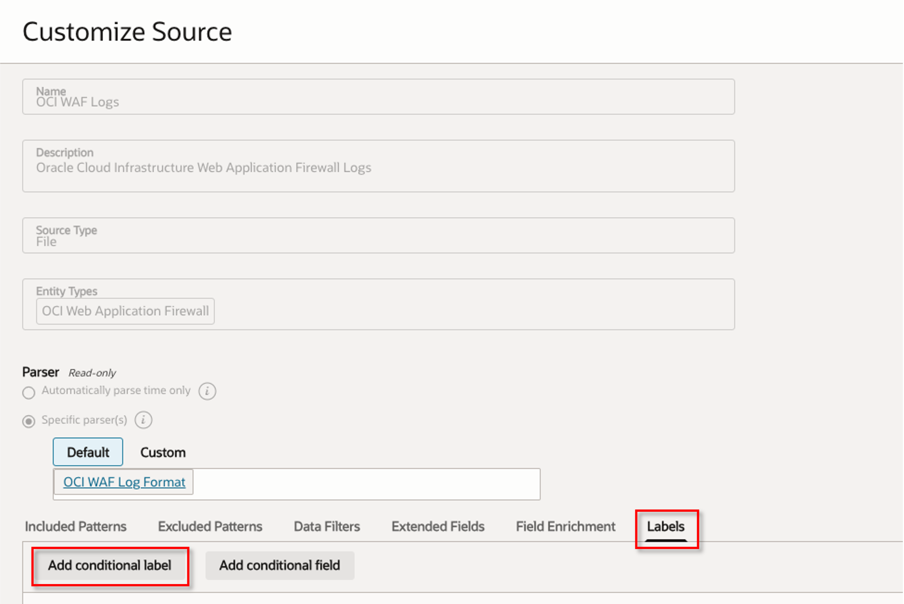
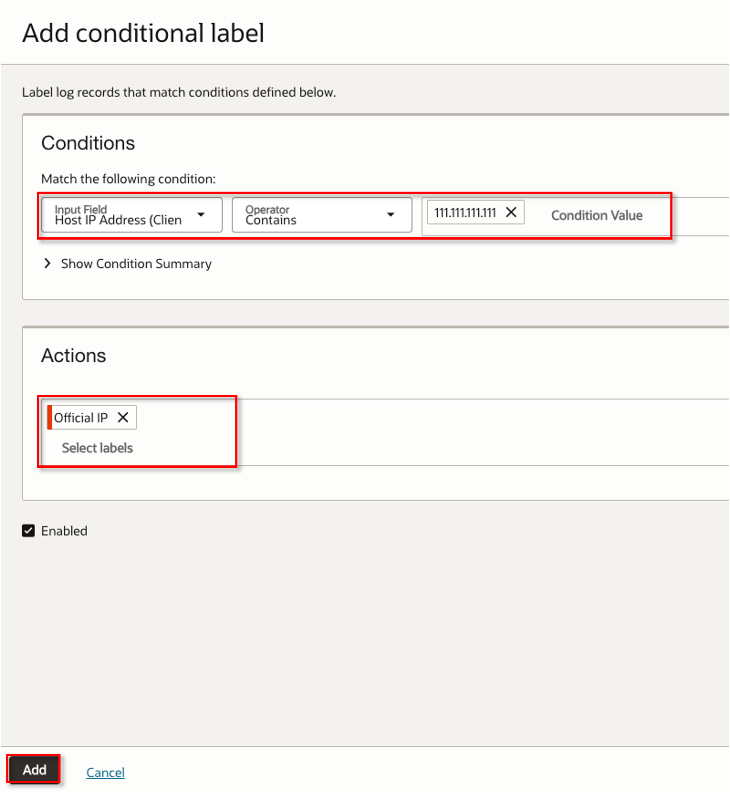
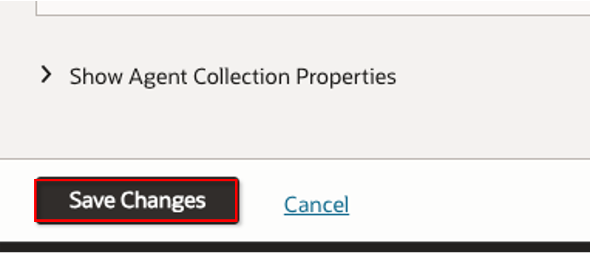

WAF用ダッシュボードデプロイ
=====================================================================
.. note::

  * 公式が出しているダッシュボードが洗練されているので利用させていただきます

1-1. 定義ファイルDL
^^^^^^^^^^^^^^^^^^^^^^^^^^^^^^^^^^^^^^^^^^^^^^^^^^^^^^^^^^^^^^^^^^^^^
* `GitHub <https://github.com/jennylia3/oci-waf-tutorials/blob/main/WAF%20Dashboard%20-%20JP.json>`_ より json ファイルをDL

1-2. 定義ファイルインポート
^^^^^^^^^^^^^^^^^^^^^^^^^^^^^^^^^^^^^^^^^^^^^^^^^^^^^^^^^^^^^^^^^^^^^
.. note::

  * コンパートメントは ``oci-waf-policy-operations-management-environment`` を選択

* `こちら <https://oracle-japan.github.io/ocitutorials/security/waf-v2-loganalytics/#3-waf%e3%83%ad%e3%82%b0%e3%81%ae%e3%83%80%e3%83%83%e3%82%b7%e3%83%a5%e3%83%9c%e3%83%bc%e3%83%89%e5%ae%9a%e7%be%a9%e3%81%ae%e3%82%a4%e3%83%b3%e3%83%9d%e3%83%bc%e3%83%88>`_ を参考

ラベル付与
=====================================================================
.. note::

  * ``Log Analytics`` にログを取り込む際、条件にマッチするログにラベルを付与する設定を追加
  * そうすることで、クエリをしやすくする

* ``Observability & Management`` → ``Administration`` をクリック

* ``Sources`` → ``OCI WAF Logs`` をクリック

* ``Customize`` をクリック

* ``Labels`` → ``Add conditional label`` をクリック

* ``Conditions`` に、取り込んだログのフィールド内データで検索したい条件を記載
* 今回は、クライアントがブロックされたログを検索しやすくしたいため、クライアントIPを条件に加えます
* ``Actions`` に、 ``Conditions`` で指定した条件にマッチしたログに付与するラベルを指定します

* ``Save Changes`` をクリックして完了

